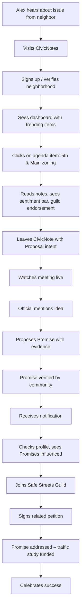
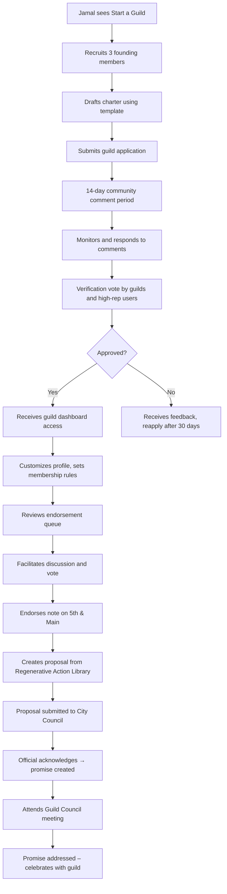
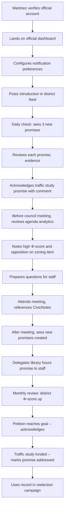
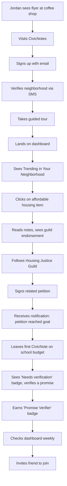
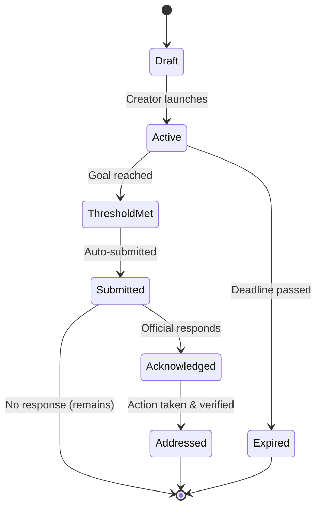
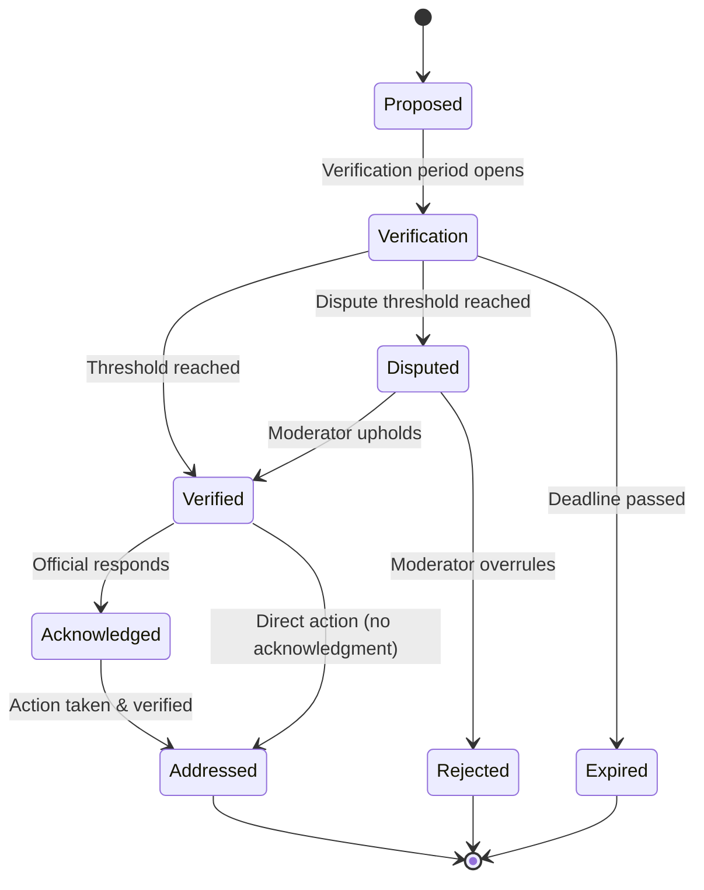

# User Journeys

A user journey maps the complete experience of a person interacting with CivicNotes—from initial discovery through ongoing engagement and impact. By tracing the steps, emotions, and touchpoints of different personas, we can design flows that are intuitive, empowering, and aligned with their goals. This document presents the primary journeys for our core user personas, using placeholders for visual diagrams that illustrate key flows.

---

## Overview of User Journeys

Each journey is structured in phases:
```markdown
Discovery → Onboarding → Core Action → Impact → Ongoing Engagement
```

Different personas follow different paths, but all share a common arc: they come to understand the platform, take meaningful action, see the results of that action, and are drawn back to participate further.

The following sections detail journeys for:

- **Alex** – The concerned resident
- **Jamal** – The guild leader
- **Martinez** – The elected official
- **Jordan** – The new user

Plus cross‑cutting journeys for **petitions** and **promises**.

---

## Alex's Journey: From Concern to Impact

Alex hears about a zoning change at 5th and Main from a neighbor. Curious and concerned, they decide to check it out on CivicNotes.



### Phase 1: Discovery

| Step | Description | Touchpoints | Emotions |
|------|-------------|-------------|----------|
| **Hears about issue** | Neighbor mentions the zoning change at a block party. | Word of mouth | Curious, slightly concerned |
| **Visits CivicNotes** | Types app.civicnotes.org into phone browser. | Homepage | Curious, hopeful |
| **Signs up** | Quick sign‑up with email, verifies neighborhood via SMS. | Signup form, SMS verification | Efficient, slightly impatient |

### Phase 2: First Engagement

| Step | Description | Touchpoints | Emotions |
|------|-------------|-------------|----------|
| **Dashboard landing** | Sees upcoming meetings, trending items, district Φ‑score. | Dashboard | Overwhelmed but guided |
| **Finds agenda item** | Clicks on "City Council – Apr 15" and scrolls to Item #7. | Agenda list | Focused |
| **Reads notes** | Sees 34 notes from neighbors, a sentiment bar, and a guild‑endorsed proposal. | Agenda item page | Reassured (others care) |
| **Leaves a note** | Clicks "Leave a CivicNote," types concern, selects "Proposal" intent. | Note composer | Empowered |

### Phase 3: Witnessing Impact

| Step | Description | Touchpoints | Emotions |
|------|-------------|-------------|----------|
| **Watches meeting** | Clicks "Watch Live" from agenda item, sees council member mention their idea. | Video player, agenda item | Excited, validated |
| **Proposes a promise** | After meeting, clicks "Propose Acknowledgment" on their note, pastes video timestamp. | Promise creation form | Hopeful |
| **Receives notification** | Days later: "Your promise was verified!" | In‑app notification, email | Proud |

### Phase 4: Ongoing Engagement

| Step | Description | Touchpoints | Emotions |
|------|-------------|-------------|----------|
| **Checks dashboard** | Now sees "Promises you've influenced" on profile. | Dashboard, profile | Motivated |
| **Joins a guild** | Discovers Safe Streets Guild, clicks "Join." | Guild page | Connected |
| **Signs a petition** | Sees related petition, signs with SMS verification. | Petition page | Part of something bigger |
| **Celebrates success** | Months later: "Promise addressed – traffic study funded!" | Notification, promise page | Joyful, fulfilled |

---

## Jamal's Journey: Building Collective Power

Jamal has been organizing around pedestrian safety for years. He wants to formalize the group and amplify their impact through a guild.



### Phase 1: Guild Formation

| Step | Description | Touchpoints | Emotions |
|------|-------------|-------------|----------|
| **Discovers guild feature** | Sees "Start a Guild" in navigation, reads about benefits. | Guild directory | Intrigued |
| **Recruits founders** | Messages three active members, gets their consent. | Direct message | Collaborative |
| **Drafts charter** | Uses template, defines mission and governance. | Charter editor | Thoughtful |
| **Submits application** | Fills form, uploads charter, lists founders. | Guild application | Anticipatory |

### Phase 2: Verification

| Step | Description | Touchpoints | Emotions |
|------|-------------|-------------|----------|
| **Comment period** | Monitors comments, answers questions. | Application page | Anxious but engaged |
| **Verification vote** | Watches vote progress, encourages supporters. | Voting interface | Nervous |
| **Approval notification** | "Congratulations! Your guild is verified." | Notification | Elated |

### Phase 3: Guild Activities

| Step | Description | Touchpoints | Emotions |
|------|-------------|-------------|----------|
| **Sets up dashboard** | Adds logo, sets membership rules, invites members. | Guild dashboard | Productive |
| **Reviews endorsement queue** | Sees suggested notes, opens discussion. | Endorsement queue | Strategic |
| **Facilitates vote** | Members vote to endorse 5th and Main note. | Voting interface | Satisfied |
| **Creates proposal** | Uses Regenerative Action Library to draft traffic calming proposal. | Proposal editor | Creative |

### Phase 4: Impact and Governance

| Step | Description | Touchpoints | Emotions |
|------|-------------|-------------|----------|
| **Tracks promise** | Proposal leads to official acknowledgment; promise appears. | Promise Tracker | Hopeful |
| **Attends Guild Council** | Represents guild at quarterly meeting, votes on platform policies. | Council meeting | Influential |
| **Celebrates win** | Promise addressed – traffic study funded. Shares with guild. | Announcements, social media | Proud |

---

## Martinez's Journey: Responsive Governance

Martinez, a city council member, wants to understand constituent priorities and respond efficiently. They've just verified their official account.



### Phase 1: Setup and Discovery

| Step | Description | Touchpoints | Emotions |
|------|-------------|-------------|----------|
| **Verifies account** | Uses .gov email, receives official badge. | Verification flow | Official, legit |
| **First login** | Lands on official dashboard, sees overview. | Official dashboard | Curious, slightly overwhelmed |
| **Sets notifications** | Configures daily digest, promise alerts. | Settings | Organized |
| **Introduces themselves** | Posts a brief announcement in their district feed. | Note composer | Welcoming |

### Phase 2: Daily Engagement

| Step | Description | Touchpoints | Emotions |
|------|-------------|-------------|----------|
| **Morning check** | Sees 3 new promises in inbox, reviews each. | Promise inbox | Focused |
| **Acknowledges promise** | Clicks "Acknowledge," adds brief comment: "Staff is reviewing." | Acknowledgment form | Efficient |
| **Reviews agenda** | Before council meeting, checks items with high Φ‑scores and many notes. | Agenda analytics | Prepared |
| **Notes constituent sentiment** | Sees strong opposition to zoning item, prepares questions. | Agenda item page | Informed |

### Phase 3: Meeting and Follow‑Up

| Step | Description | Touchpoints | Emotions |
|------|-------------|-------------|----------|
| **Attends meeting** | References CivicNotes in remarks: "Many of you have commented on 5th and Main..." | Public meeting | Connected |
| **Checks after meeting** | Sees new promises created from their statements. | Promise inbox | Accountable |
| **Delegates to staff** | Assigns Taylor to respond to library hours promise. | Staff delegation | Relieved |

### Phase 4: Long‑term Engagement

| Step | Description | Touchpoints | Emotions |
|------|-------------|-------------|----------|
| **Monthly review** | Checks district Φ‑score trends, sees Responsiveness up 5 points. | Analytics | Proud |
| **Responds to petition** | Library hours petition reaches goal; acknowledges with commitment. | Petition response | Responsive |
| **Marks promise addressed** | Traffic study funded – clicks "Mark Addressed," uploads resolution. | Promise detail | Fulfilled |
| **Runs for reelection** | Points to CivicNotes record as proof of engagement. | Campaign materials | Confident |

---

## Jordan's Journey: First Steps

Jordan just moved to the city and wants to get involved but doesn't know where to start. They're the classic new user.



### Phase 1: Onboarding

| Step | Description | Touchpoints | Emotions |
|------|-------------|-------------|----------|
| **Hears about platform** | Sees flyer at coffee shop: "Have a say in your city." | Physical flyer | Intrigued |
| **Visits site** | Types URL, sees clean homepage with Φ‑score map. | Homepage | Welcomed |
| **Signs up** | Email sign‑up, verifies neighborhood via SMS (takes 2 minutes). | Signup, SMS | Easy |
| **Takes tour** | Brief 3‑step overlay introduces Φ‑score, notes, promises. | Guided tour | Informed but not overwhelmed |

### Phase 2: First Actions

| Step | Description | Touchpoints | Emotions |
|------|-------------|-------------|----------|
| **Dashboard landing** | Sees "Trending in Your Neighborhood" – affordable housing item. | Dashboard | Relevant |
| **Reads notes** | Clicks through, sees a proposal from Housing Justice Guild. | Agenda item | Interested |
| **Follows a guild** | Clicks "Follow" on the guild page. | Guild profile | Connected |
| **Signs a petition** | Sees related petition, signs with one click (SMS verification). | Petition page | Empowered |

### Phase 3: Early Wins

| Step | Description | Touchpoints | Emotions |
|------|-------------|-------------|----------|
| **Receives notification** | Petition reaches goal – "You helped make this happen!" | Notification | Validated |
| **Leaves first note** | Encouraged, leaves a note on a school budget item. | Note composer | Nervous but proud |
| **Verifies a promise** | Sees "Needs verification" badge, reviews evidence, votes yes. | Verification interface | Helpful |

### Phase 4: Becoming a Regular

| Step | Description | Touchpoints | Emotions |
|------|-------------|-------------|----------|
| **Checks weekly** | Now part of routine – 10 minutes every Sunday. | Dashboard | Habitual |
| **Earns first badge** | "Promise Verifier" – shares on social media. | Profile | Proud |
| **Invites a friend** | Uses invite feature to bring a neighbor onboard. | Invite flow | Like a community builder |

---

## Petition Lifecycle Journey

A petition moves through stages from creation to resolution. This journey can be experienced by creators, signers, and officials.



| Stage | Creator | Signer | Official |
|-------|---------|--------|----------|
| **Draft** | Writes petition, sets goal and deadline. | – | – |
| **Active** | Promotes, monitors signatures. | Discovers, signs, shares. | May monitor (optional). |
| **Threshold Met** | Celebrates; petition auto‑submits. | Receives notification. | Receives notification. |
| **Submitted** | Waits for response. | Waits for response. | Sees in dashboard; may acknowledge. |
| **Acknowledged** | Shares update with signers. | Sees acknowledgment. | Publicly responded. |
| **Addressed** | Celebrates; closes loop. | Receives celebration. | Marks addressed with evidence. |
| **Expired** | May relaunch or pivot. | – | – |

---

## Promise Lifecycle Journey

A promise is the core accountability unit. This journey involves proposers, verifiers, and officials.



| Stage | Proposer | Verifier | Official |
|-------|----------|----------|----------|
| **Proposed** | Submits evidence. | – | – |
| **Verification** | Waits for votes. | Reviews evidence, votes. | – |
| **Verified** | Receives confirmation. | May be notified if voted. | Sees in inbox. |
| **Acknowledged** | Sees official response. | Sees acknowledgment. | Responds publicly. |
| **Addressed** | Celebrates; may get credit. | May verify addressed. | Marks addressed with evidence. |
| **Disputed** | May need to provide more info. | May be involved in dispute. | May be asked for input. |

---

## Cross‑Cutting Themes

### Emotional Arc

Across all journeys, a common emotional pattern emerges:

| Phase | Emotion |
|-------|---------|
| **Discovery** | Curiosity, hope |
| **First action** | Nervousness, empowerment |
| **Seeing impact** | Validation, pride |
| **Ongoing engagement** | Belonging, purpose |
| **Celebration** | Joy, fulfillment |

### Key Touchpoints

| Touchpoint | Purpose |
|------------|---------|
| **Dashboard** | Orientation, overview, quick actions |
| **Notifications** | Timely, relevant nudges |
| **Profile** | Identity, history, reputation |
| **Help/guidance** | Progressive disclosure, contextual tips |
| **Celebration moments** | Positive reinforcement, sharing |
